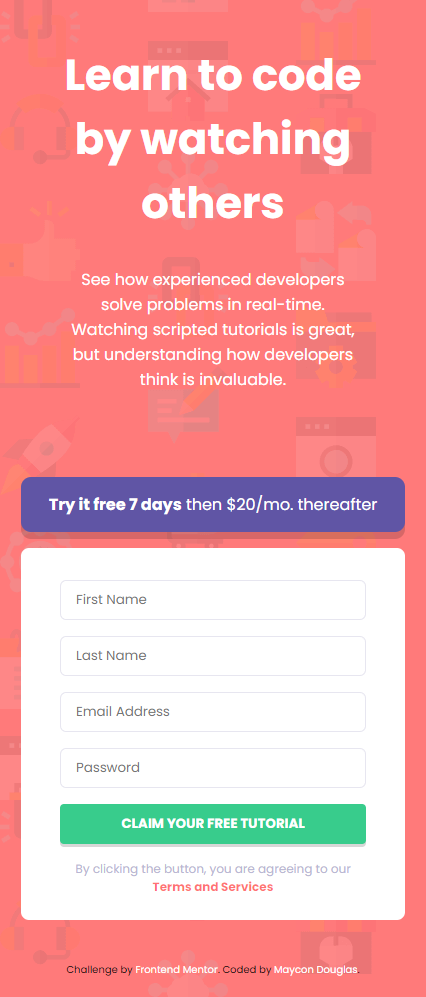

<h1 align="center"> Frontend Mentor - Intro component with sign-up form challenge hub </h1>
  

 Solução para o desafio <a href="https://www.frontendmentor.io/challenges/intro-component-with-signup-form-5cf91bd49edda32581d28fd1">Intro component with sign-up form</a>. Usando HTML e CSS Flexbox.

<h2 align="center">Desktop-design esperado: </h2>

<h2 align="center">Resultado final:</h2>

<h2 align="center">Mobile-design esperado: </h2>

<h2 align="center">Resultado final:</h2>

